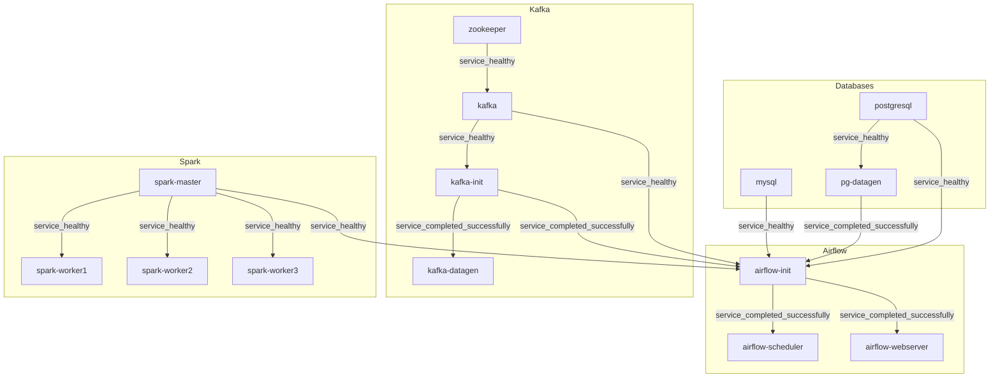

# Итоговое домашнее задание по дисциплине "Python для инженерии данных"

Проект представляет собой ***полностью автоматизированную*** систему обработки данных, разворачиваемую ***одной командой***. Конфигурация проекта облегчена для запуска на локальной машине.

### Стек
- **Airflow**: Оркестрация.
- **Spark**: Обработка данных.
- **PostgreSQL** и **MySQL**: Реляционные базы данных.
- **Kafka** : Брокер сообщений.
- **Python**: Генераторы данных в PG и Kafka.
- **Docker**: Контейнеризация сервисов.


## Автоматизация

Система состоит из 14 контейнеров:
1. PostgreSQL
2. MySQL
3. Spark Master
4. Spark Worker 1,2,3
5. Генератор данных для PostgreSQL (pg_datagen)
6. Генератор данных для Kafka (kafka_datagen)
7. Kafka Init
8. Kafka
9. Zookeeper
10. Airflow Init
11. Airflow Scheduler
12. Airflow Webserver

Все контейнеры основаны на открытых Docker Image. Они автоматически настраиваются и проверяют свою готовность с использованием Healthcheck. Система обеспечена скриптами для автоматической генерации данных, их репликации, стриминга и создания аналитических витрин.


### Dependency Graph сборки

Каждая нода графа - отдельный сервис.



### Сущности базы данных:

- **users**: Информация о пользователях.
  - `user_id` (PK): Уникальный идентификатор пользователя.
  - `first_name`: Имя пользователя.
  - `last_name`: Фамилия пользователя.
  - `email`: Электронная почта (уникальное значение).
  - `phone`: Номер телефона.
  - `registration_date`: Дата регистрации.
  - `loyalty_status`: Статус лояльности (`Gold`, `Silver`, `Bronze`).

- **productcategories**: Иерархия категорий товаров.
  - `category_id` (PK): Уникальный идентификатор категории.
  - `name`: Название категории.
  - `parent_category_id` (FK): Ссылка на родительскую категорию.

- **products**: Информация о товарах.
  - `product_id` (PK): Уникальный идентификатор товара.
  - `name`: Название товара.
  - `description`: Описание товара.
  - `category_id` (FK): Категория товара.
  - `price`: Цена товара.
  - `stock_quantity`: Количество товара на складе.
  - `creation_date`: Дата добавления товара.

- **orders**: Информация о заказах.
  - `order_id` (PK): Уникальный идентификатор заказа.
  - `user_id` (FK): Пользователь, сделавший заказ.
  - `order_date`: Дата заказа.
  - `total_amount`: Общая сумма заказа.
  - `status`: Статус заказа (`Pending`, `Completed`, и т.д.).
  - `delivery_date`: Дата доставки.

- **orderdetails**: Детали заказов.
  - `order_detail_id` (PK): Уникальный идентификатор детали заказа.
  - `order_id` (FK): Ссылка на заказ.
  - `product_id` (FK): Ссылка на товар.
  - `quantity`: Количество товаров в заказе.
  - `price_per_unit`: Цена за единицу товара.
  - `total_price`: Общая стоимость позиции.

- **reviews**: Отзывы о товарах.
  - `review_id` (PK): Уникальный идентификатор отзыва.
  - `user_id` (FK): Пользователь, оставивший отзыв.
  - `product_id` (FK): Продукт, на который оставлен отзыв.
  - `rating`: Оценка товара (от 1 до 5).
  - `review_text`: Текст отзыва.
  - `created_at`: Дата создания отзыва.

- **loyaltyPoints**: Система лояльности.
  - `loyalty_id` (PK): Уникальный идентификатор записи.
  - `user_id` (FK): Пользователь, получивший бонусные баллы.
  - `points`: Количество начисленных баллов.
  - `reason`: Причина начисления (например, "Order", "Promotion").
  - `created_at`: Дата начисления.
 
    
## Сервисы и их конфигурация

### Управление конфигурацией
Вся конфигурация проекта управляется через единый файл `.env`, который содержит параметры для всех сервисов, включая логины, пароли, порты и настройки генерации данных.

### Доступы к данным и UI сервисов

### PostgreSQL
- **URL**: `jdbc:postgresql://localhost:5432/postgres_db?currentSchema=source`
- **Логин**: `db_user`
- **Пароль**: `qwerty`

### MySQL
- **URL**: `jdbc:mysql://localhost:3306/mysql_db`
- **Логин**: `db_user`
- **Пароль**: `qwerty`

### Airflow Web UI
- **URL**: `http://localhost:8080`
- **Логин**: `admin`
- **Пароль**: `admin`

### Spark Master
- **URL**: `http://localhost:8081`

### Kafka
- **Bootstrap Servers**: `localhost:9092`
- **Топик**: `new_user_events`

### Генерация данных

**Параметры генерации для PostgreSQL по умолчанию:**
  - Количество пользователей: 500
  - Количество товаров: 800
  - Количество заказов: 3000
  - Детали заказов: от 1 до 10 на заказ
  - Категории товаров: 20
  - Отзывов о товарах: 2000
  - Начислений бонусовЖ 3000

**Параметры генерации для Kafka по умолчанию:**
  - Интервал генерации событий: 5 секунды
  - Топик Kafka: `new_user_events`
  - События генерируются в формате JSON с полями: `first_name`, `last_name`, `email`, `phone`, `registration_date`, `loyalty_status`.

## Репликация данных
В Airflow реализована репликация данных из PostgreSQL в MySQL. DAG выполняет следующие задачи:
1. Извлечение данных из PostgreSQL.
2. Трансформация данных через Spark.
3. Сохранение данных в MySQL.

## Стриминг данных
В Airflow реализована обработка данных из Kafka. DAG выполняет следующие задачи:
1. Получение данных из топика Kafka.
2. Обработка данных с использованием Spark.
3. Сохранение данных в PostgreSQL.

## Аналитические витрины

### Витрина активности пользователей (mart_user_activity)

#### Описание
Витрина для последующего анализа поведения пользователей - количества заказов и общей суммы затрат, разбитых по статусам заказов.

#### Поля и их описание

| Поле           | Описание                      |
|----------------|-------------------------------|
| user_id        | Идентификатор пользователя    |
| first_name     | Имя пользователя              |
| last_name      | Фамилия пользователя          |
| status         | Статус заказа                 |
| order_count    | Количество заказов            |
| total_spent    | Общая сумма затрат            |

### Витрина рейтинга продуктов (mart_product_rating)

#### Описание
Витрина для последующего анализа рейтинга товаров. Может быть использована, например, для исследования популярности товаров и их соответствия ожиданиям клиентов.

#### Поля и их описание
| Поле                   | Описание                          |
|------------------------|-----------------------------------|
| product_id             | Идентификатор товара              |
| name                   | Название товара                   |
| rating                 | Средний рейтинг                   |

### Витрина бонусных баллов (mart_user_loyalty_points)

#### Описание
Витрина для последующего анализа пользователей по кол-ву бонусных баллов. Может быть использована, например, для исследования групп пользователей в рамках бонусной системы.

#### Поля и их описание
| Поле                 | Описание                      |
|----------------------|-------------------------------|
| user_id              | Идентификатор пользователя    |
| first_name           | Имя пользователя              |
| last_name            | Фамилия пользователя          |
| loyalty_status       | Уровень бонусной системы      |
| total_loyalty_points | Кол-во бонусных баллов        |

### Витрина средних чеков (mart_average_check)

#### Описание
Витрина для последующего анализа средних чеков с разбивкой по статусу заказа и статусу лояльности. Может быть использована, например, для оценки эффективностм маркетинговых стратегий и программ лояльности, или для настройки акций и предложений для разных групп клиентов.

#### Поля и их описание
| Поле               | Описание                               |
|--------------------|----------------------------------------|
| status             | Статус заказа                          |
| loyalty_status     | Статус лояльности пользователя         |
| average_check      | Средний чек для группы заказов         |

### Скрипты для витрин

Для создания витрин используется Spark. Скрипты загружают данные из MySQL, выполняют агрегации и сохраняют результаты обратно в базу данных. Шаги:
1. Загрузка исходных данных из базы данных MySQL.
2. Выполнение трансформаций (объединения, группировки, агрегации, etc.)
3. Сохранение результирующих витрин в базу данных MySQL.

## Запуск

1. Запустить команду:
    ```
    docker compose up --build [-d]
    ```
2. После сборки проекта и его развертывания будут доступны интерфейсы PostgreSQL, MySQL, Airflow, Kafka и Spark по указанным выше URL.
3. Все что остается сделать вручную после окончания деплоя - включить (переевсти в `unpaused`) DAG в UI Airflow. 


## Структура проекта
Проект организован следующим образом:
```plaintext
DE2024_PY_CourseWork/
├── .env                # Переменные окружения для настройки всех сервисов
├── docker-compose.yml  # Конфигурация Docker Compose
├── infra/              # Инфраструктура контейнеров
│   ├── airflow/        # Конфигурация Airflow
│   │   ├── init/       
│   │   ├── scheduler/  
│   │   └── webserver/  
│   ├── datagen/        # Конфигурация для генераторов данных
│   │   ├── pg_datagen/
│   │   └── kafka_datagen/
│   ├── db/             # Конфигурация СУБД
│   │   ├── mysql/     
│   │   └── postgresql/
│   ├── messaging/      # Конфигурация ZK&Kafka
│   │   ├── kafka/
│   │   ├── kafka_init/
│   │   └── zookeeper/
│   └── spark/          # Конфигурация Spark
│       ├── spark-master/
│       └── spark-worker/
├── code/               # Исходный код
│   ├── airflow/        # DAG и скрипты для Airflow
│   │   ├── dags/       
│   │   └── scripts/    
│   │       ├── helpers/        
│   │       └── pyspark_scripts/ 
│   ├── datagen/        # Генераторы данных
│   │   ├── pg_datagen/ # Скрипты для генерации данных в PG
│   │   └── kafka_datagen/ # Скрипты для генерации данных в Kafka
```
